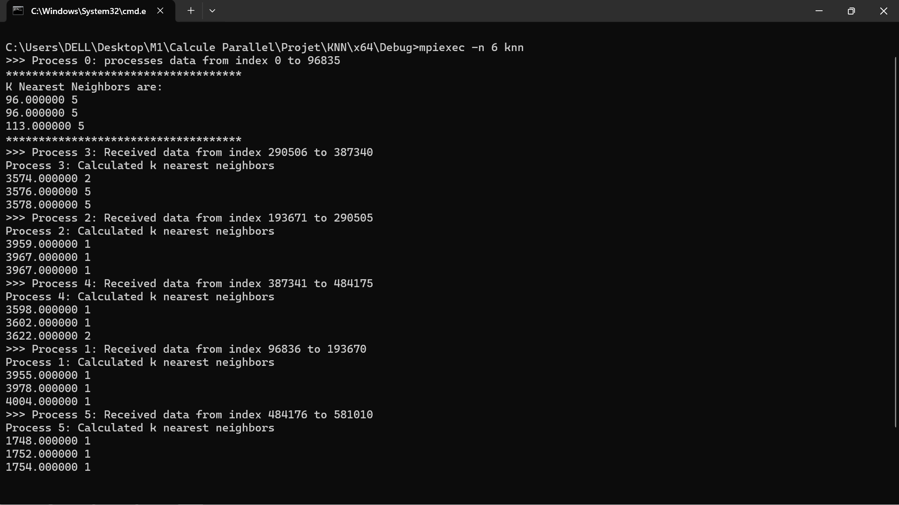
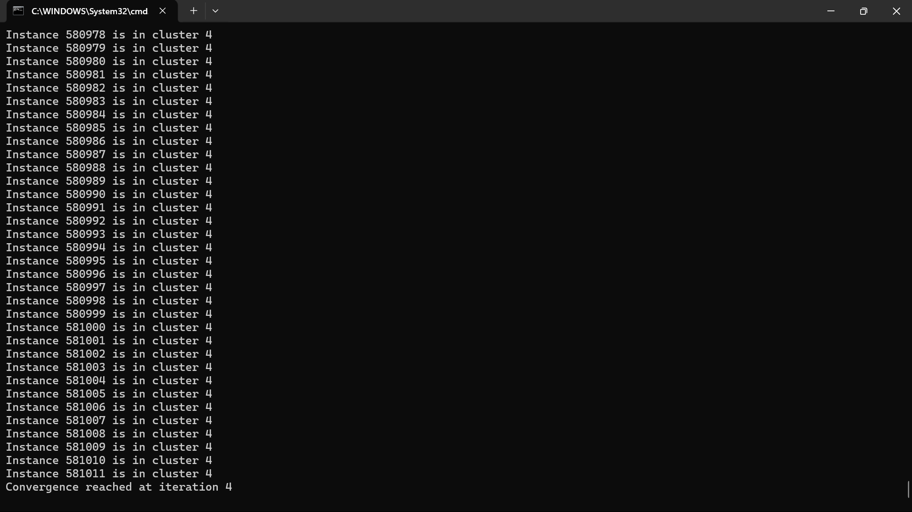

Implementing **KNN** and **K-means** algorithms with two versions : **MPI** & **Threads** \
The goal is to minimize their execution time as dataset get large \
Sumarry : [View the full PDF](./Rapport.pdf)

